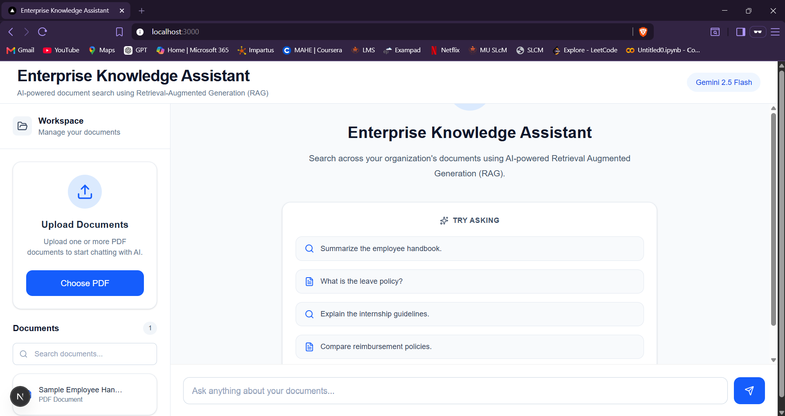
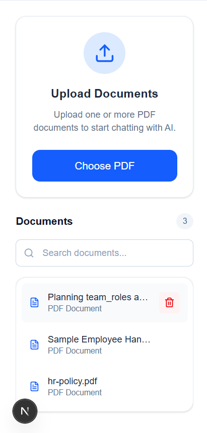
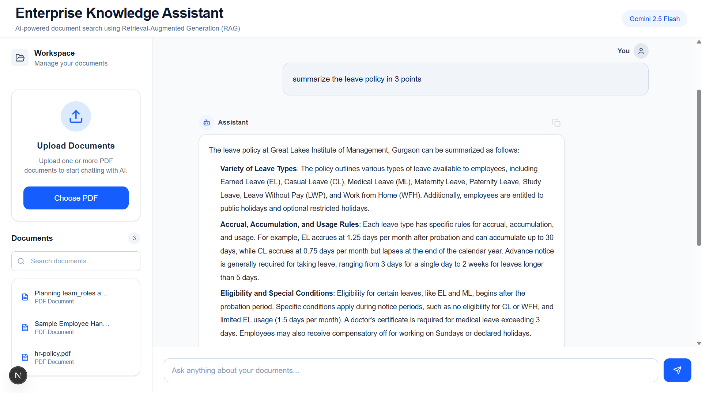
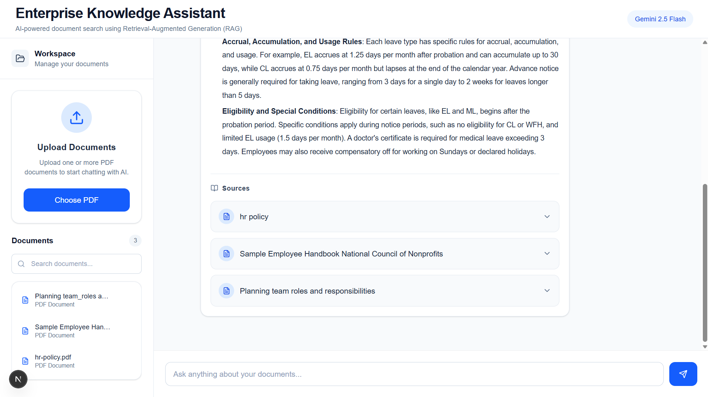

# Enterprise Knowledge Assistant


> AI-powered enterprise document search using Retrieval-Augmented Generation (RAG).

An intelligent document assistant that enables users to upload PDF documents, perform semantic search, and receive context-aware answers with source attribution using Google's Gemini 2.5 Flash.

---

## Screenshots

### Welcome Screen



---

### Document Workspace



---

### AI Chat



---

### Source Attribution



---

## Features

- Upload and process PDF documents
- AI-powered question answering using Google Gemini 2.5 Flash
- Retrieval-Augmented Generation (RAG)
- Semantic search using Sentence Transformers
- ChromaDB vector database for document retrieval
- Paragraph-aware document chunking with overlap
- Source attribution with expandable citations
- Markdown-formatted AI responses
- One-click response copying
- Document upload, search, and deletion
- Responsive and modern user interface
- Toast notifications and confirmation dialogs

---

## System Architecture

See the complete architecture here:

[Architecture Diagram](README_assets/architecture.md)

---

## Tech Stack

### Frontend

- Next.js 15
- React
- TypeScript
- Tailwind CSS
- Axios
- React Markdown
- Lucide React

### Backend

- FastAPI
- Python
- Pydantic

### AI & Retrieval

- Google Gemini 2.5 Flash
- Sentence Transformers (all-MiniLM-L6-v2)
- ChromaDB
- PyPDF

---

## How It Works

### Document Processing Pipeline

1. Upload a PDF document.
2. Extract text using PyPDF.
3. Clean and preprocess the extracted text.
4. Split the document into paragraph-aware chunks with overlap.
5. Generate semantic embeddings using Sentence Transformers.
6. Store embeddings and metadata inside ChromaDB.

### Question Answering Pipeline

1. User submits a natural language question.
2. Generate an embedding for the query.
3. Retrieve the most relevant document chunks from ChromaDB.
4. Provide the retrieved context to Gemini 2.5 Flash.
5. Generate a Markdown-formatted response.
6. Display the answer together with expandable source citations.

---

## Project Structure

```text
enterprise-knowledge-assistant
│
├── backend
│   ├── database
│   ├── models
│   ├── rag
│   ├── routes
│   ├── services
│   ├── uploads
│   ├── main.py
│   └── requirements.txt
│
├── frontend
│   ├── app
│   ├── components
│   ├── constants
│   ├── hooks
│   ├── services
│   ├── types
│   └── package.json
│
├── README_assets
│   ├── architecture.md
│   └── screenshots
│
└── README.md
```

---

## Installation

### Clone the repository

```bash
git clone https://github.com/<your-username>/enterprise-knowledge-assistant.git
```

### Backend Setup

```bash
cd backend

python -m venv venv

# Windows
venv\Scripts\activate

# macOS/Linux
source venv/bin/activate

pip install -r requirements.txt

uvicorn main:app --reload
```

The backend will be available at:

```
http://localhost:8000
```

---

### Frontend Setup

```bash
cd frontend

npm install

npm run dev
```

The frontend will be available at:

```
http://localhost:3000
```

---

## Environment Variables

Create a `.env` file inside the `backend` directory.

```env
GEMINI_API_KEY=YOUR_GEMINI_API_KEY
```

---

## Key Features Implemented

- Retrieval-Augmented Generation (RAG)
- Semantic document search
- Metadata-based source attribution
- Expandable source citations
- PDF document management
- Document search
- Document deletion with embedding cleanup
- Copy AI responses
- Markdown rendering
- Responsive chat interface
- Upload progress indicators
- Toast notifications
- Confirmation dialogs

---

## Future Improvements

- OCR support for scanned PDF documents
- Streaming AI responses
- Conversation history
- User authentication
- Multi-user workspaces
- Drag-and-drop document uploads
- Docker support
- Cloud storage integration

---

## Author

**Jahnavi Kallolini**

Built as a portfolio project to demonstrate the design and development of a modern Retrieval-Augmented Generation (RAG) application using Next.js, FastAPI, ChromaDB, Sentence Transformers, and Google Gemini 2.5 Flash.