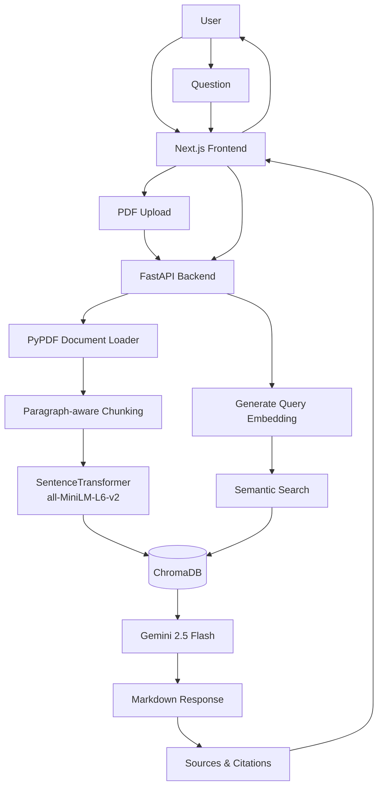

# System Architecture

```mermaid
flowchart TD

    A[User]

    B[Next.js Frontend]

    C[FastAPI Backend]

    D[PDF Upload]

    E[PyPDF Document Loader]

    F[Paragraph-aware Chunking]

    G[SentenceTransformer<br/>all-MiniLM-L6-v2]

    H[(ChromaDB)]

    I[Question]

    J[Generate Query Embedding]

    K[Semantic Search]

    L[Gemini 2.5 Flash]

    M[Markdown Response]

    N[Sources & Citations]

    A --> B

    B --> D

    D --> C

    C --> E

    E --> F

    F --> G

    G --> H

    A --> I

    I --> B

    B --> C

    C --> J

    J --> K

    K --> H

    H --> L

    L --> M

    M --> N

    N --> B

    B --> A
```